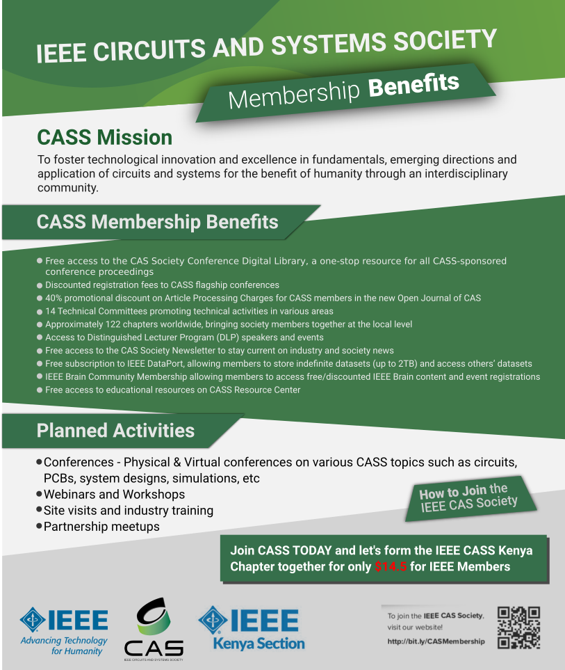

# Hi, welcome!

# What is IEEE?
The [IEEE](http://ieee.org) (Eye-triple-E) is a non-profit, technical professional association that is world's largest technical professional organization dedicated to advancing technology for the benefit of humanity.

# What is IEEE CASS?

# How do I join?
Refer above

# How do I participate?
- Join our events (webinars, talks, meetups, conferences)
- Helping in planning of such activities thorugh joining the committee
- Being an active IEEE and IEEE CASS member

# Connect with us
